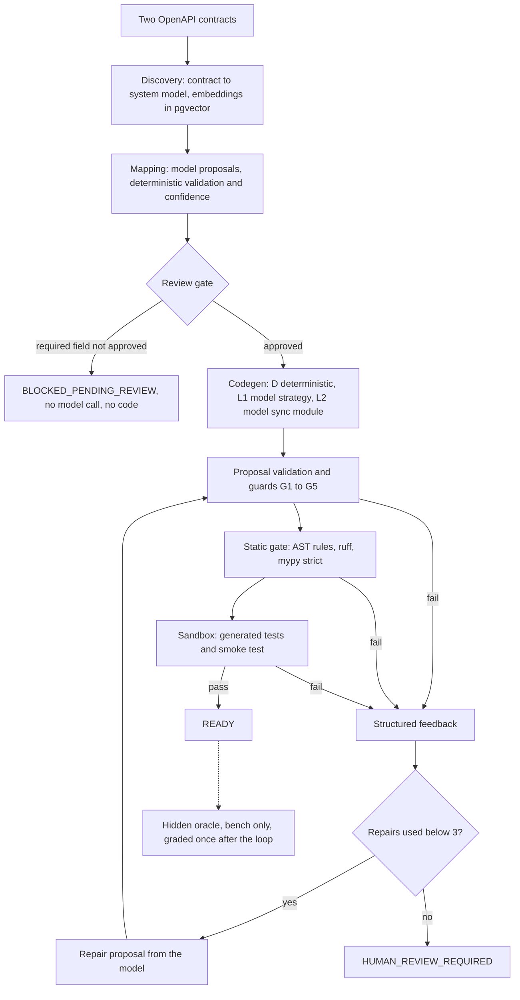
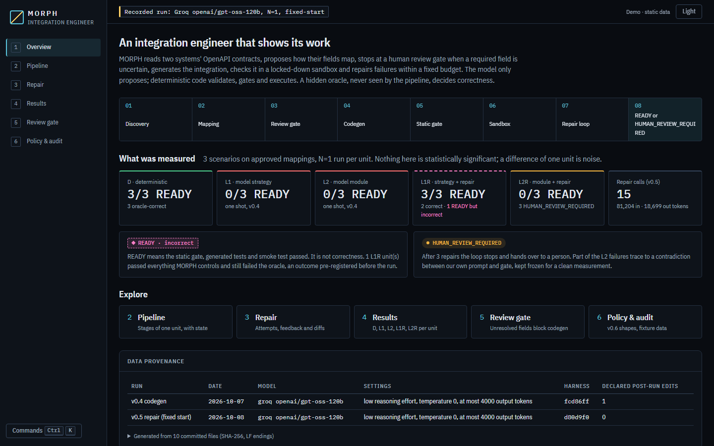
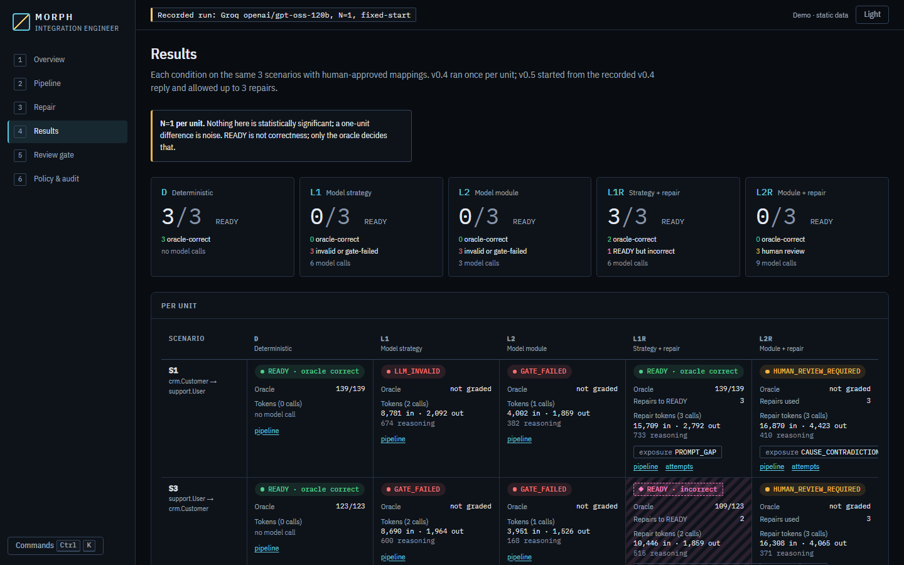
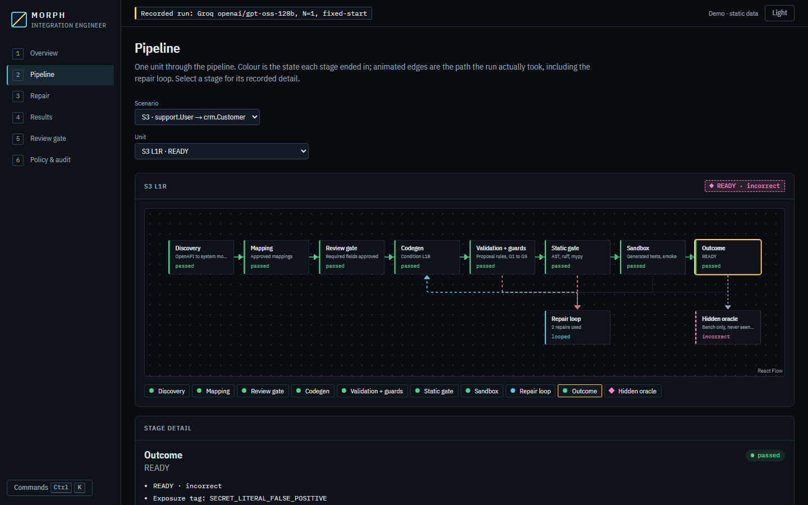
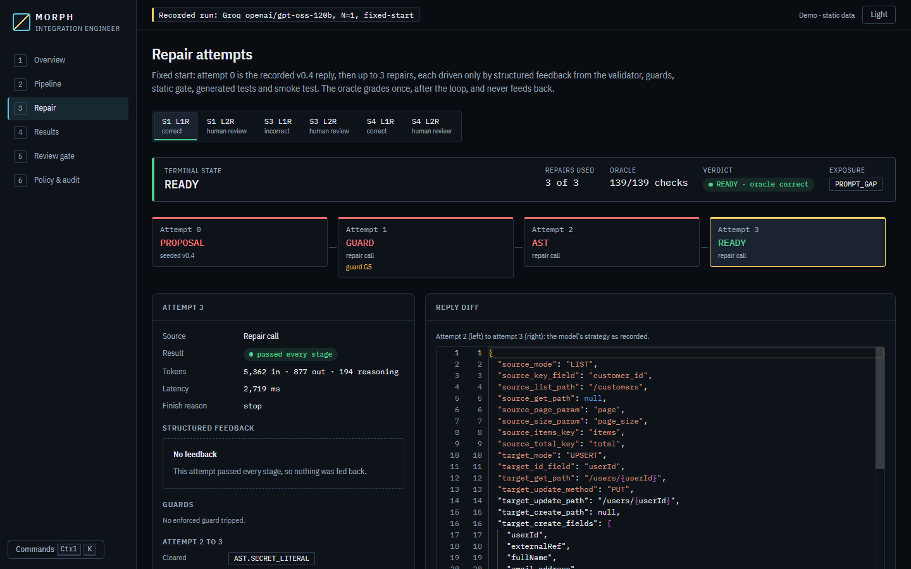

# MORPH

An autonomous integration engineer: given two independently built systems' OpenAPI contracts, it proposes how their data maps, generates the integration, tests it in a sandbox, and repairs failures within a fixed budget.

[](https://github.com/vahinichilukamarri/MORPH-Autonomous-AI-Integration-Engineer/actions/workflows/ci.yml)

## What MORPH is

MORPH discovers two systems' APIs from their contracts, proposes field mappings between mismatched schemas, and stops at a human review gate when a required field is uncertain. From approved mappings it generates integration code, runs it through static gates and generated tests inside a locked-down Docker sandbox, and, when a step fails, feeds structured feedback to a bounded repair loop. Each run ends in `READY` or `HUMAN_REVIEW_REQUIRED`. Correctness is judged separately by a hand-written oracle that the pipeline never sees.

The rule throughout: the model returns structured proposals; deterministic code validates, authorises and executes them.

## Architecture

The repair pipeline (v0.5). In v0.4 the same stages ran once, with no repair loop.



The loop is a LangGraph state graph (`plan, propose, validate, build, guard, gates, tests, smoke, feedback, decide`) with Postgres checkpoints, so a run can pause and resume. Code: [backend/app/repair/graph.py](backend/app/repair/graph.py), [backend/app/codegen/](backend/app/codegen/).

## Design principles enforced in code

| Principle | Where it is enforced |
|---|---|
| A model is called only for mapping, code or strategy generation and repair proposals; parsing, validation, planning, gating, test execution and state transitions are plain code. Every model output is parsed into a Pydantic model; invalid output is a recorded result, not a crash. | [backend/app/llm/](backend/app/llm/), [backend/app/mapping/](backend/app/mapping/), [backend/app/repair/nodes.py](backend/app/repair/nodes.py) |
| Review gate: if a required, writable target field is not approved, the integration is `BLOCKED_PENDING_REVIEW` and no model is called. | [backend/app/codegen/review_gate.py](backend/app/codegen/review_gate.py) |
| Gates never loosen. The model can only change its own file; guards reject changed base tests (G2), suppression comments (G3), more type escapes than the previous attempt (G4) and dropped mapped fields (G5). | [backend/app/repair/guards.py](backend/app/repair/guards.py) |
| Generated code runs only in the sandbox: read-only root, internal network with only the mocks, no capabilities, 256 MB, 0.5 CPU, 64 processes, 60 s, verified inside the container before anything runs. | [docs/sandbox.md](docs/sandbox.md), [backend/app/codegen/sandbox.py](backend/app/codegen/sandbox.py) |
| The oracle never feeds repair. A source-level test forbids the repair package from importing bench, oracle or answer-key code, importing dynamically, or reaching a live provider. | [backend/tests/repair/test_isolation.py](backend/tests/repair/test_isolation.py), [backend/tests/test_architecture.py](backend/tests/test_architecture.py) |
| Every real model call is recorded and replayed offline in CI; reports are regenerated from committed results and fail on any undeclared edit. | [bench/replays/](bench/replays/), [bench/scripts/render_reports.py](bench/scripts/render_reports.py) |

## Results

All numbers below come from committed result files. Model: `openai/gpt-oss-120b` on the Groq free tier, temperature 0, **N = 1 per unit**, three scenarios. Nothing here is statistically significant; a difference of one unit is noise.

Scenarios: **S1** CRM customer to Support user, **S3** Support user to CRM customer, **S4** CRM v2 to Support v2, all on human-approved mappings. Conditions:

- **D**: deterministic compile and heuristic strategy, no model (reference).
- **L1 / L2** (v0.4, one shot): the model proposes the sync strategy and edge cases (L1) or writes the sync module (L2).
- **L1R / L2R** (v0.5, fixed start): attempt 0 is the recorded v0.4 reply (no new call), followed by up to 3 repairs.

`READY` means the static gate, generated tests and smoke test passed. It is **not** correctness; only the oracle (checks O1 to O7) decides that.

| Unit | Condition | Outcome | Oracle O1-O7 (passed/total) | Repairs used | Model calls | Input / output tokens |
|---|---|---|---|---|---|---|
| S1 | D | READY | 139/139 | - | 0 | - |
| S3 | D | READY | 123/123 | - | 0 | - |
| S4 | D | READY | 139/139 | - | 0 | - |
| S1 | L1 | `LLM_INVALID` | not graded | - | 2 | 8,781 / 2,092 |
| S3 | L1 | `GATE_FAILED` (AST `SECRET_LITERAL`) | not graded | - | 2 | 8,690 / 1,964 |
| S4 | L1 | `LLM_INVALID` | not graded | - | 2 | 8,792 / 2,071 |
| S1 | L2 | `GATE_FAILED` (AST suppression comment) | not graded | - | 1 | 4,002 / 1,859 |
| S3 | L2 | `GATE_FAILED` (AST syntax) | not graded | - | 1 | 3,951 / 1,526 |
| S4 | L2 | `GATE_FAILED` (AST syntax) | not graded | - | 1 | 4,008 / 1,773 |
| S1 | L1R | READY, oracle correct | 139/139 | 3 | 3 | 15,709 / 2,792 |
| S3 | L1R | READY, **incorrect** | 109/123 (14 failed) | 2 | 2 | 10,446 / 1,859 |
| S4 | L1R | READY, oracle correct | 139/139 | 1 | 1 | 5,225 / 1,239 |
| S1 | L2R | `HUMAN_REVIEW_REQUIRED` (exhausted at GUARD) | not graded | 3 | 3 | 16,870 / 4,423 |
| S3 | L2R | `HUMAN_REVIEW_REQUIRED` (exhausted at RUFF) | not graded | 3 | 3 | 16,308 / 4,065 |
| S4 | L2R | `HUMAN_REVIEW_REQUIRED` (exhausted at RUFF) | not graded | 3 | 3 | 16,646 / 4,321 |

L1R/L2R tokens are the repair calls only; attempt 0 reused the v0.4 reply. In v0.4 the same three scenarios with unreviewed (as-proposed) mappings were blocked by the review gate in every condition, with zero model calls.

**v0.4 (one shot):** D reached a ready, oracle-correct integration on 3/3; L1 on 0/3; L2 on 0/3. All three L2 replies were rejected at the AST stage, so none reached ruff, mypy, the sandbox or the oracle.

**v0.5 (repair, fixed start):** L1R reached READY on 3/3: 2 oracle-correct and 1 READY-but-incorrect (S3, 14 failed oracle checks). That S3 outcome was pre-registered before the run: its strategy still overwrites `segment` on update, and nothing in the gate, generated tests or smoke test signals that. L2R reached READY on 0/3; all three ended `HUMAN_REVIEW_REQUIRED` after 3 repairs.

Caveats that matter for reading this:

- Part of the L2 failures trace to our own frozen design: the L2 prompt tells the model to use `error.__cause__`, which the AST gate bans as dunder access. On S1 L2R the last attempt was rejected by guard G4 (type escapes rose from 13 to 17), so whether it fixed its ruff and mypy findings was never observed.
- The gate reports one stage at a time, so an L2 unit needing four or five rounds cannot finish in three. Whether a fourth repair would have helped is not known and not claimed.
- When repair removed `__cause__`, that is compliance with a "follow the check" instruction, not the model discovering the conflict.
- Part of the L1 failures were prompt gaps: the frozen L1 prompt never states the `UPSERT` field-list rule the validator enforces.
- One model, one run per unit, synthetic scenarios.

Full reports: [docs/codegen-eval.md](docs/codegen-eval.md) and [docs/codegen-eval-findings.md](docs/codegen-eval-findings.md) (v0.4); [docs/repair-eval.md](docs/repair-eval.md) and [docs/repair-eval-findings.md](docs/repair-eval-findings.md) (v0.5). Mapping accuracy against the answer keys is in [docs/mapping-eval.md](docs/mapping-eval.md).

## Honest findings

- **READY is not correct.** S3 L1R passed every gate and test MORPH controls and still failed 14 oracle checks. A pipeline that reports its own gates as success would have counted it.
- **Negative results are reported as results.** L1 and L2 reached READY on 0 of 3 each in v0.4, and L2R on 0 of 3 in v0.5. They stay in every denominator.
- **Some defects were ours, and were kept frozen.** The `__cause__` prompt/gate contradiction, the unstated `UPSERT` rule, and an AST rule that flags benign long test strings as secrets were found during the runs. Fixing them mid-experiment would have mixed two systems in one measurement, so they are tagged per unit and left for a separately labelled v2 run.
- **The oracle was revised after D had run against it (r1).** Of 413 checks, 14 were revised and 98 added after the first D run, so D's 3/3 is not a blind result. Every change and its reason is in [docs/milestones.md](docs/milestones.md).
- **Post-run edits are declared.** A manual edit to the v0.4 results file (the model label on 12 rows) is recorded with its scope and evidence in [bench/results/codegen-v0.4/provenance.json](bench/results/codegen-v0.4/provenance.json); the v0.5 run declares none.
- **Repair feedback worked where the signal existed.** The validator, guard and AST findings the L1R units were told about were cleared on the next attempt; the `segment` flaw, which no check reports, was not touched.

## Engineering practices

- **Pre-registration.** The fixed-start repair run's protocol, caps, exposure tags and the one predicted outcome were committed before any real call: [docs/plans/v0.5-fixed-start-preregistration.md](docs/plans/v0.5-fixed-start-preregistration.md).
- **Golden hashes.** Prompts, the repair graph, guards, limits and the D bundles are frozen by hash tests ([backend/tests/codegen/test_frozen_codegen.py](backend/tests/codegen/test_frozen_codegen.py), [backend/tests/repair/test_frozen_repair.py](backend/tests/repair/test_frozen_repair.py)). A change means a new labelled version, never a retune on the same scenarios.
- **Frozen-path diffs.** From v0.6 on, each milestone report checks `git diff --stat` on the frozen evaluation paths against a fixed baseline commit; only declared changes are allowed.
- **Replay-based CI.** Real replies are committed and replayed through the real gate and sandbox with no network; `scripts.render_reports --check` regenerates both evaluation reports and checks the provenance hashes.
- **Append-only disclosures.** Errata and post-hoc changes are added as dated sections, not edited away.
- **Controls for heuristics.** Guards, the smoke test and the sandbox containment corpus each have positive and negative controls, including the recorded v0.4 replies as fixtures.

## Status

| Milestone | Scope | Status |
|---|---|---|
| v0.1-foundation | Skeleton, compose, mock CRM and Support with OpenAPI, failure injection, answer-key format, CI | Done (tagged) |
| v0.2-discovery | OpenAPI to system model, persistence, embeddings in pgvector | Done (tagged) |
| v0.3-mapping | Model mapping proposals, deterministic validation, confidence, accuracy against answer keys | Done (tagged; validator v2 rescoring tagged `v0.3.1-validator`) |
| v0.4-codegen | Generated integration in the Docker sandbox, static gate, hidden oracle, D/L1/L2 evaluation | Done (tagged) |
| v0.5-repair | Bounded LangGraph repair loop, guards, fixed-start evaluation | Done for the fixed-start run (sub-milestones tagged `v0.5-m2`, `v0.5-m3`); the fresh-start phase is planned and needs its own approval |
| v0.6-mcp-policy | Capabilities as MCP tools, a policy layer gating every tool call | In progress: M0 (MCP SDK spike and import-isolation tests) done; policy core, audit, MCP gateway and evaluation planned |
| v0.7-ui | Workspace: canvas, activity stream, mapping, code, test lab, repair view | In progress on branch `ui/v0.7`: demo mode, six screens, tests; policy screen uses fixtures until v0.6 |
| v0.8-bench | MORPH-Bench: 25 to 30 scenarios, metrics from real runs, report | Planned |

Plans: [docs/plans/](docs/plans/). Per-milestone run and verify steps: [docs/milestones.md](docs/milestones.md).

## UI (v0.7, in progress)

A static demo runs entirely in the browser from data generated out of the committed results and replays (`frontend/scripts/build-demo-data.ts`); a test rebuilds that data and fails on any drift. No backend, key, Docker or database is needed:

```powershell
cd frontend
npm ci
npm run dev
```

Screens: overview, pipeline (React Flow), repair attempts (Monaco diff), results, review gate, and policy and audit. The policy screen shows fixture data in the v0.6 plan's shapes, labelled FIXTURE, because the v0.6 endpoints do not exist yet. `npm run dev:live` uses the REST API where endpoints exist.

| | |
|---|---|
|  |  |
|  |  |

Screenshots are written by the Playwright smoke test (`MORPH_SCREENSHOTS=1 npm run e2e`); more in [docs/img/](docs/img/).

## Quickstart (PowerShell, from the repo root)

Prerequisites: Docker Desktop (running), Python 3.12, Node 22+, and `uv`. None of the commands below call a model.

```powershell
docker compose up -d --wait postgres
./scripts/dev.ps1 lint            # ruff, mypy, tsc, eslint
./scripts/dev.ps1 test            # all Python test suites; needs the dev Postgres, not the sandbox
./scripts/dev.ps1 sandbox-build   # sandbox and mock images
./scripts/dev.ps1 sandbox-test    # containment corpus, gate tools, generated tests
./scripts/dev.ps1 oracle          # the oracle against condition D (slow)
./scripts/dev.ps1 codegen-eval --conditions D
./scripts/dev.ps1 up              # Postgres, mocks, backend :8000, frontend :5173
```

Replay the committed repair run offline (no network, no API key). The second command needs the dev Postgres and the images from `sandbox-build`:

```powershell
cd bench
uv run python -m scripts.render_reports --check   # regenerate both reports and check provenance
uv run pytest smoke_tests -q                      # D smoke test, then every recorded unit through the real gate and sandbox
cd ..
```

Real-model runs need `GROQ_API_KEY` in a git-ignored `.env`; the codegen and repair evaluations also refuse to call a model without `--confirm-real-run`. See [docs/milestones.md](docs/milestones.md).

## Repository map

| Path | Contents |
|---|---|
| [backend/](backend/) | FastAPI service: discovery, mapping, codegen, static gate, sandbox runner, repair graph, LLM providers, MCP probe |
| [mock_systems/](mock_systems/) | Mock CRM and Support APIs with OpenAPI contracts, sample data and deterministic fault injection |
| [sandbox/](sandbox/) | Sandbox image, gate configuration and the trusted runtime library generated code runs on |
| [bench/](bench/) | Scenarios, answer keys, oracle, evaluation scripts, committed results and replays |
| [frontend/](frontend/) | React + TypeScript + Vite UI: static demo of the recorded runs, live mode over the REST API |
| [docs/](docs/) | Design notes, evaluation reports and findings, milestone plans and reports |
| [scripts/](scripts/) | `dev.ps1` developer commands |

## Known limitations

- Groq free tier only: one model (`openai/gpt-oss-120b`), rate limited, so runs are small.
- N = 1 per unit and three scenarios per condition; no result is statistically significant.
- The scenarios are synthetic: two mock systems built for this project, not real production systems.
- The oracle was revised after the reference condition was run against it (disclosed above).
- The fresh-start repair phase, MCP and policy layer, product UI and the larger benchmark are not built yet.
