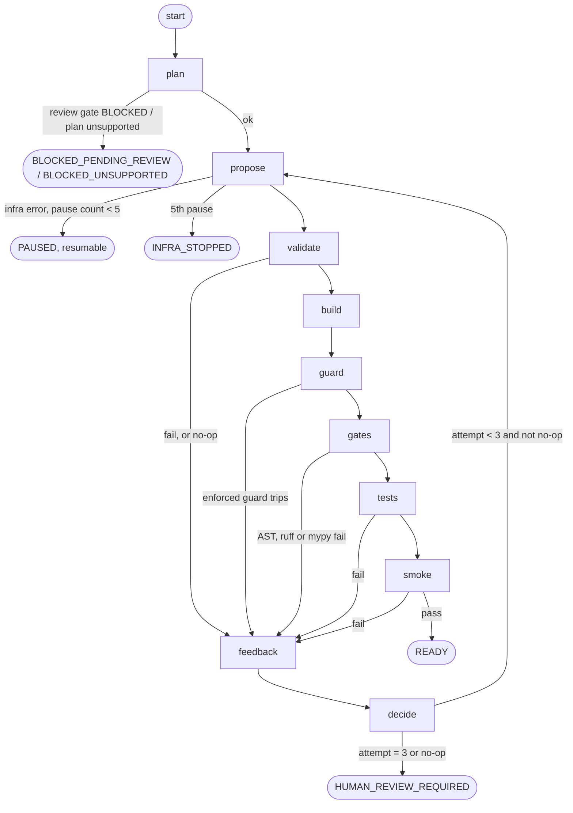

# v0.5-repair: plan

Status: **approved with amendments** (amendments are marked **[A1]** to **[A14]** and listed in
section 11). Scope of the milestone: a LangGraph repair loop around code generation. A unit that
fails a runtime check gets structured feedback and retries up to `MAX_REPAIR_ATTEMPTS = 3`, then
ends in `HUMAN_REVIEW_REQUIRED`. Condition D is unaffected. LangGraph is a dependency of the repair
module only.

Estimates in this document are labelled **ESTIMATE**. Every other number is a v0.4 measurement.
Items marked **[verify in M0]** are resolved with evidence in `docs/plans/v0.5-m0-report.md`.

## 0. Decisions

| # | Decision |
|---|---|
| Attempts | Attempt 0 is the initial generation; repairs are attempts 1 to 3. A unit gets at most 4 model turns. |
| Budget | One shared budget of 3 repairs for every failure kind. **[A1]** |
| Re-ask | The inner single re-ask is disabled in `+R` mode (`reask=False`); each turn is one provider call. **[A1]** |
| Conditions | Ids are `L1R` and `L2R`. `allow_partial=False` in the evaluation. **[A1]** |
| Start modes | Fixed-start is the primary repair-effect measurement. Fresh-start is secondary and needs its own, later approval. **[A1]** |
| Verdict | READY in `+R` means: AST, ruff and mypy pass, **and** the generated tests pass, **and** a repair-mode-only smoke test passes. **[A5]** |
| Oracle | Never an input to repair. The oracle grades a READY unit once, after the loop ends. |
| Defects | The primary evaluation keeps the v0.4 gate, prompts and validator frozen. Units exposed to the two known defects are tagged in advance. gate-v2 and prompt-v2 are a separate, later, labelled run. |
| Persistence | Our domain tables hold content; the LangGraph Postgres checkpointer holds position only. |

## 1. State machine

### 1.1 Definitions

- A **model turn** is exactly one provider call that produces a proposal. An **attempt** is one
  model turn plus everything after it (validate, guard, build, gates, tests, smoke).
- **Attempt 0** is the initial generation. **Attempts 1 to 3** are repairs, so `MAX_REPAIR_ATTEMPTS = 3`
  means at most 4 model turns. A unit that fails attempt 3 ends in `HUMAN_REVIEW_REQUIRED`.
- A no-op attempt still counts: the model call was spent, and the unit stops early.
- **Failure classification [A3].**
  - These are **model failures and use an attempt**: output truncated by the length limit
    (`finish_reason=length`), empty output, and non-JSON output.
  - These are **infrastructure pauses and do not use an attempt**: a provider error, an HTTP 429
    that exhausts the provider's own retries, sandbox `START_FAILED`, and `LimitsNotEnforced`.
  - **`SIZE_REJECTED` [A11]** is also infrastructure but is not a pause: when the provider answers
    "request too large" (HTTP 413) the response is deterministic, so it is not retried, it is not an
    attempt, and the unit ends `INFRA_STOPPED` at once with the estimate recorded.
  - A unit may pause **at most 5 times**. After the fifth pause the run stops and reports the unit
    as `INFRA_STOPPED` with the reason. It is a reported stop, not a result about the model, and it
    is never retried inside the same run.
  - Zero-call exits (blocked units) are not attempts.

### 1.2 Shared budget, and how the v0.4 re-ask fits

One shared budget of 3 repairs for every failure kind (proposal validation, guard, AST, ruff, mypy,
generated tests, smoke test). The scarce resource is model calls under a 1,000/day limit; separate
budgets would allow up to 3+3 repairs and double the worst case, and one ladder keeps
"attempts-to-READY" a single comparable number.

The v0.4 re-ask re-asks once on invalid output with the validation error. That is already a one-shot
repair of the same failure class. In `+R` mode it is **disabled** (`complete_structured(..., reask=False)`),
because otherwise one attempt could cost two calls and the "4 turns" bound would be false. The
validator failure goes through the normal feedback path instead.

Consequence for comparison: v0.4 L1 spent up to 2 calls before stopping; L1R spends up to 4. Reports
state this and never describe L1R as "L1 plus one extra try".

### 1.3 Nodes, edges, terminals



| Node | Kind | What it does |
|---|---|---|
| `plan` | deterministic | Runs `analyse` and `decide` (the existing review gate). A blocked unit exits here with zero model calls and no provider constructed on that path. |
| `propose` | **the only model node** | Attempt 0 uses the v0.4 prompts unchanged. Attempts 1 and later use the repair prompt: the original rendered prompt, the previous output, the feedback and a history line. |
| `validate` | deterministic | L1: Pydantic parse plus the contract validator. L2: parse the JSON envelope and check the source. Also the no-op check against every earlier attempt's output. |
| `build` | deterministic | `generate_package` plus `render_tests`, the same functions D uses. |
| `guard` | deterministic | Anti-gaming guards (section 3); they inspect the built bundle, so they run after `build`. |
| `gates` | deterministic | The same `check_ast` and `run_tool_gate`, imported, not copied. |
| `tests` | deterministic | The generated tests run in the sandbox. |
| `smoke` | deterministic | The repair-mode-only smoke test (section 1.4). |
| `feedback` | deterministic | Builds the structured feedback (section 2). |
| `decide` | deterministic | Budget and no-op decision. |

Terminal states:

| State | Meaning |
|---|---|
| `READY` (and `READY_PARTIAL` only if `allow_partial`, which the evaluation does not use) | All checks in section 1.4 pass. |
| `HUMAN_REVIEW_REQUIRED` | Reason `EXHAUSTED:<last failing stage>` or `NO_OP`. |
| `BLOCKED_PENDING_REVIEW`, `BLOCKED_UNSUPPORTED` | Exit before any model call. Unchanged from v0.4. |
| `INFRA_STOPPED` | Five pauses on one unit. Reported with the reason; not a model result. |

`LLM_INVALID` stays a per-attempt outcome and a v0.4 status for non-repair L1 and L2. It is **not** a
terminal of the repair graph: a unit whose last attempt is still invalid ends as
`HUMAN_REVIEW_REQUIRED` with reason `EXHAUSTED:PROPOSAL`. `PAUSED` is a resumable run state, never a
reported outcome.

### 1.4 What READY means in `+R` **[A5]**

READY requires all of:

1. AST gate, ruff and mypy pass (unchanged v0.4 gate).
2. The generated tests pass in the sandbox.
3. The **repair-mode smoke test** passes.

Why a smoke test: the generated tests exercise only the compiled transformer
(`integration.transform.to_target`); they never import the sync module or the strategy, so for L1
and L2 they give no runtime signal on the model's contribution at all. The smoke test is the
smallest runtime signal that does.

Smoke test design (all of it outside the generated bundle, so D bundle hashes are unchanged):

- It lives in the repair module and is passed to the sandbox as the `python -c` argument, with the contract's page-key names supplied by the caller (an L2 bundle's manifest strategy is empty, so the shape is the one D derives). The
  sandbox runner already mounts only the bundle, read-only; **no containment change is needed**
  (confirmed in M0, `v0.5-m0-report.md`).
- It checks **execution only**: the bundle's entry point (`python -m integration`) imports, runs to
  completion against **in-memory fake clients** for the source and target, and produces a run report
  of the expected shape (valid JSON line with `records` and `requests`).
- It asserts **nothing about record contents**, outcomes or request counts. It cannot encode the
  answer key.
- It must pass for **D's bundle** (D has no `sync.py`; its entry point runs the runtime's
  `SyncEngine` with `strategy.py`). A test enforces this for S1, S3 and S4.
- Smoke failures produce feedback like any other stage (`stage=SMOKE`).

Caveat that stays in the findings: READY under repair means "passes the static gates, the
deterministic tests and the smoke test". It does **not** mean the integration is correct. Only the
oracle can say that, and the oracle is eval-only.

## 2. Feedback signals and format

Allowed inputs, runtime-available only: the L1 mapping/strategy validator, the AST gate, ruff, mypy,
the sandbox result, the generated tests, and the smoke test.

**The oracle is never an input.** It is eval-only, and feeding it back would be leakage.
Enforcement:

1. **Import-isolation test** (`backend/tests/repair/test_isolation.py`). It walks the **transitive**
   import graph from `app.repair` with `ast`, and fails if anything reachable names `morph_bench`,
   `oracle`, `answer_key` or `bench/`. **[A2]** It additionally scans `app/repair/**` for dynamic
   import and execution routes: `importlib`, `__import__`, `exec`, `eval`, `compile`, `runpy`. Any
   occurrence fails the test.
2. **Repair code never reads `bench/oracle` or `bench/fixtures`**, and never opens a path outside the
   bundle it is repairing and its own prompt files. The same scan checks for those path strings.
3. **API shape.** The graph's public entry takes no callable and no data that carries grading
   results. The harness grades after the run ends.
4. **Fixed-start attempt 0 comes only through an injected replay path [A2].** The graph receives an
   explicit `seed_provider` (a `ReplayLLMProvider`) for attempt 0 and nothing else. **A missing
   replay record is a hard error that aborts the unit; it never falls through to a live call.** A
   test uses a seed store with the record removed and a live provider that raises on any call.
5. **One-way grading.** If a READY unit fails the oracle, nothing is retried; it is reported as
   "gate-passing, incorrect".

Feedback format. It is built only from structured fields, never from raw stdout or stderr.

```text
Feedback(attempt=k, items=[FeedbackItem], omitted=n)
FeedbackItem(stage: PROPOSAL|GUARD|AST|RUFF|MYPY|TESTS|SMOKE, code: str,
             file: str|None,   # bundle-relative, POSIX separators
             line: int|None, message: str)  # at most 200 chars
```

- Sorted by `(stage order, file, line, code)`. At most 8 items and 1,200 characters in total (see the
  budget mitigation in section 7); overflow becomes `omitted`.
- Paths are POSIX and bundle-relative. Interpreter-specific text, such as the file name inside a
  `SyntaxError` message, is stripped with the same normalisation the v0.4 replay test needed.
- Pydantic errors keep `loc` and `msg` only; the `input` echo is dropped.
- No env values or secrets. Messages come from rule codes and our own templates. For
  `SECRET_LITERAL`, the item names the field or edge-record index and the string **length**, never
  the literal (the rule exists because a literal might be a secret). A test greps feedback for the
  env values the harness sets.
- A one-line history carries codes only: `previous: attempt 0: PROPOSAL[omit_if_null]; attempt 1: AST[DUNDER_ACCESS]`.
- Feedback and the previous output go in delimited data blocks, never into instructions (rule 10).
- Deterministic: the same inputs give the same bytes, and the feedback is part of the prompt hash.

## 3. Anti-gaming guards

The model's writable surface is already small. L1 writes a strategy JSON plus edge records (source
records only; the **expected values are computed by the compiler**, confirmed in M0). L2 writes only
`integration/sync.py`. The transformer, the clients and the generated tests are rendered
deterministically, so test deletion and mapping loosening are mostly structurally impossible. The
guards make that a checked invariant. They are static and cannot prove behavioural equivalence;
that is what the oracle is for.

**[A4] Enforced guards (G1 to G5)** reject an attempt and produce feedback. **Shadow guards (G6, G7)
only log and never reject.**

| Guard | Mode | Trips when |
|---|---|---|
| **G1 surface** | enforced | Any bundle file other than the model-owned one differs from an independent deterministic rebuild. Model-owned: `sync.py` for L2; the strategy and edge-record test data for L1. |
| **G2 tests frozen** | enforced | The base generated-test set (rendered from `decision.included` and `inp.samples`) changes in content or count across attempts. L1 edge records may add cases; they can never reduce the base set. |
| **G3 suppression** | enforced | Already enforced by the AST gate (`_SUPPRESSION`). No duplicate rule; a test asserts the gate rule is still in the repair path and cannot be skipped. |
| **G4 Any loosening** | enforced | The count of `Any`, `cast(` and `object` annotations in `sync.py` **rises** against the previous attempt, or a new type escape appears. A flat ban would reject legitimate runtime-typed code, so the rule is monotone non-increase. mypy settings are not model-writable and a hash assertion pins them. **No baseline [A14]:** if the previous attempt's source is unparseable (or its reply was truncated, empty or not JSON, so it has no source) G4 does not run on the next attempt, and that attempt's own count becomes the baseline for the one after it. G4 remains reject-only and every trip is logged. |
| **G5 required fields** (negative tests **[A13]**) | enforced | The strategy's create or update field lists omit a contract-required target field, or an approved mapping that the contract lets a create or update request carry is in neither list (a mapped identity the target assigns itself is not counted; M1 found this on S3). Computed from the contract and the review decision, never from the oracle or an answer key. |
| **G6 record mutation** | **shadow** | `sync.py` calls `del`, `.pop`, `.popitem` or `.clear` on the record returned by `to_target`. Logged only. |
| **G7 swallowed failures** | **shadow** | A bare `except:` or `except Exception: pass`. Logged only. |
| **No-op** | enforced | The normalised output hash (L2: the source with blank lines and trailing whitespace removed, comments kept; L1: canonical JSON) equals **any** earlier attempt's hash. Stops immediately with `HUMAN_REVIEW_REQUIRED(NO_OP)`; the attempt counts. |

Shadow guards write their would-be trips into the attempt record so the report can state how often
they would have fired, and promoting either to enforced is a later, labelled decision.

**Every guard must pass D's bundle [A4].** D has no `sync.py`, so the guards that inspect the
model-owned file are run on D's generated files (`integration/*.py`) and, as a reference
implementation, on `morph_runtime/sync.py` (shadow-mode results included). A test runs all seven
guards (and the no-op check against itself) over D's bundle for S1, S3 and S4 and requires zero
trips. A guard that rejects D is a bug in the guard.

A trip is a normal failure: feedback with `stage=GUARD`, one attempt consumed. Per-attempt diff
statistics are recorded, not gated.

## 4. Invariants that do not change

1. **Gates never loosen during repair.** `app.repair` imports `check_ast` and `run_tool_gate`; it
   never builds its own. Gate-version and ruff/mypy-config hashes are asserted per attempt, and a
   frozen-hash test pins the rule set.
2. **Blocked units never enter repair and never call a model.** A test uses a provider that raises on
   any call and checks that no checkpoint row exists beyond the terminal.
3. **Sandbox containment is unchanged.** Same `SandboxRunner`, same limits, no new mounts; the
   containment corpus still runs.
4. **Every real call is recorded as a replay.** The key is the prompt hash, which includes the
   feedback and the attempt index. A replay miss fails loudly. Records also store the full usage
   block (section 10).
5. **CI replays every repair run offline.** No model, and no network except the mocks.
6. **D is unaffected.** `langgraph` is imported only under `app/repair/**`. A test scans the AST of
   everything else under `app/` and also checks `sys.modules` in a subprocess after importing the D
   modules. D bundle hashes are pinned by the existing golden test. The four `codegen-v1` prompt
   files are not touched; the repair prompt files are new.

## 5. The v0.4 defects, and the omit_if_null case

- Two defects are ours: the L2 prompt tells the model to check `__cause__` while the gate bans
  dunder access; and `SECRET_LITERAL` flags benign long identifiers in test data.
- `omit_if_null` is **not** a contradiction. The L1 prompt says "optional, non-nullable" and the
  model listed nullable fields anyway, twice. That is a model failure, and it is exactly what repair
  is meant to handle. Whether the validator rule itself is right stays a separate, debatable
  question (Known Issue 3 in `codegen-eval-findings.md`).
- v0.4 attempt 0 of L1 S1 and S4 had a third validator error not named in the original v0.4
  findings (`UPSERT: target_update_fields must equal target_create_fields`). The frozen L1 prompt
  does **not** state that rule, and it is a validator convention, not a compiler constraint; see the
  erratum in `codegen-eval-findings.md`. The two units are therefore tagged as prompt-gap exposed
  (below).

**Decision: the primary evaluation keeps the v0.4 gate, prompts and validator frozen.** Repair is
then measured against the same judge, and feedback citing `DUNDER_ACCESS` or `SECRET_LITERAL` is a
legitimate test of whether the model can comply over a conflicting instruction. Three amendments to
make it clean:

1. **Pre-registered exposure tags.**

   | Unit | Tag |
   |---|---|
   | L2 S1 | defect-exposed (`DUNDER_ACCESS`; it also had a model-caused `SUPPRESSION`) |
   | L1 S3 | defect-exposed (`SECRET_LITERAL`) |
   | L1 S1, L1 S4 | defect-exposed (**prompt gap**: attempt 0 failed the UPSERT field-list rule, which the frozen L1 prompt never states; they also failed `omit_if_null`, a model failure) |
   | L2 S3, L2 S4 | model failures (stray `}`) |

   Results are reported both with all units and with the exposed ones separated. Neither number
   replaces the other.
2. **`SECRET_LITERAL` feedback maps back to its origin** (edge-record index and field, plus length,
   no literal), because the finding lands in a generated file the model did not write.
3. **gate-v2 and prompt-v2 are a separately labelled condition**, run only after the primary result
   is final, with its own approval. Its contents are fixed now: the L2 prompt stops instructing
   `__cause__`; and the `SECRET_LITERAL` rule is narrowed with its own corpus review. M0 found that
   the runtime offers **no structured alternative** to `__cause__` (only `error.detail`, a free-text
   message), so prompt-v2 needs either a runtime attribute (a labelled runtime version change) or a
   gate allowance for `__cause__`; that choice belongs to that later run.

## 6. Evaluation protocol (pre-registered)

Frozen with golden hashes **before the first real call**: the repair prompt files, `GRAPH_VERSION`,
the feedback format and caps, the guard set and modes, the smoke test, plus everything v0.4 froze.
Any change after the first real call means a new, separately labelled run. **Failures are results;
there is no tuning.**

Setup: approved S1, S3 and S4; Groq `openai/gpt-oss-120b`; the v0.4 settings (temperature 0, low
reasoning effort, 4,000 max output tokens); N = 1 per unit; `allow_partial=False`.

| Condition | Start | Attempt 0 | Real calls per unit (max) |
|---|---|---|---|
| L1R fixed-start (primary) | the recorded v0.4 first reply, injected through the replay path | 0 real | 3 |
| L2R fixed-start (primary) | the recorded v0.4 reply | 0 real | 3 |
| L1R fresh-start (secondary) | a new model call | 1 real | 4 |
| L2R fresh-start (secondary) | a new model call | 1 real | 4 |

- **Fixed start isolates the repair effect from regeneration variance.** All six v0.4 attempt-0
  outputs failed (verified in M0): the three L1 first replies are rejected by the validator and the
  three L2 replies are rejected by the AST gate. For L1, attempt 0 is the **first** of v0.4's two
  replies; the second was produced under the re-ask prompt, which this design does not use. This only
  works because the attempt-0 prompt is unchanged; a prompt-hash assertion checks it.
- Fresh start: temperature 0 on a hosted model is not guaranteed deterministic, so a fresh attempt 0
  may differ from v0.4's. The two start modes are never merged in a table.
- **Fresh-start has its own, later approval.** Fixed-start runs first and is reported; fresh-start
  is not run until that report has been reviewed.
- As-proposed units (6, still blocked by v0.3's unresolved fields) are re-run as zero-call proofs
  that blocking still happens.
- D is the reference, with its v0.4 numbers.

Metrics:

1. Units reaching READY, out of 6 per start mode.
2. Attempts-to-READY (repairs used, 0 to 3).
3. Oracle result on READY units: **the first time the oracle grades model code**. O1 to O7 per
   category, O8 as in v0.4. Graded once, after the loop.
4. `HUMAN_REVIEW_REQUIRED` count with reasons (exhausted stage, no-op, guard trips); `INFRA_STOPPED` count.
5. Tokens: input, output, reasoning, and the full usage block including `total_tokens`. Seeded
   attempt-0 tokens are reported separately from the repair cost.
6. Latency per call and per unit.
7. Defect-exposure tags (section 5).
8. Which feedback stage resolved each failure, and shadow-guard would-be trips.

**Size policy [A9, replaced by A11].** The estimator is calibrated offline, before any real call, against
the recorded v0.4 `prompt_tokens` of every recorded prompt (the six first-turn prompts and the three
re-ask prompts, which resemble repair prompts: a previous reply plus an error). The report lists each
prompt's estimate against the provider's count and the error range (`v0.5-m2-report.md`).
- Estimator (an ESTIMATE, fixed before the run, not tuned afterwards): `ceil(prompt_characters / r) + e`,
  with one `r` per condition and `e` the largest v0.4 `completion_tokens` for the condition.
- **Hard stop only above the limit by more than 10%.** Before a real call the harness stops the unit
  only if the estimate exceeds the provider's per-minute token limit (8,000 in v0.4, from the recorded
  `x-ratelimit-limit-tokens` header) by more than 10% (above 8,800). Otherwise the request is sent.
- If the provider then answers "request too large", the unit is `SIZE_REJECTED`: deterministic, not
  retried, not an attempt, unit ends `INFRA_STOPPED`, and the estimate is recorded with it.
- Both kinds of stop are reported as **"not run"** and **kept in every denominator**; neither is dropped,
  and neither is a result about the model.
- **A condition is "not measurable at this tier" if fewer than 2 of its 3 units are runnable.** It is
  then reported that way and never as a model result.
- The Groq tier and limits that applied (per-minute tokens, daily requests, the model id) are recorded in
  the run's provenance. The run never changes the tier or the model.
- **First-turn prompts fit [A12].** Attempt 0 uses the v0.4 prompts: about 4.0k input tokens for both
  conditions, 4,029 to 4,086 for L1 and 3,951 to 4,008 for L2, recorded. Size risk exists only for repairs 1
  to 3, whose prompts add the previous output and the feedback.
- Preview (ESTIMATE, from the M0 report and the mitigation caps): L1 repair requests come to about 6.5k
  tokens; the L2 repair requests to about 7.7k (S3), 8.0k (S1) and 8.1k (S4). Under the 10% rule all of
  them are sent; if any is rejected by the provider it ends as `SIZE_REJECTED`. The exact figures are
  computed when the repair prompt is frozen in M3.

**Pre-registered prediction [A6].** L1 S3's *segment-overwrite flaw* (the v0.4 proposal sends
`segment` on update, overwriting an existing value) has **no runtime signal**: neither the validator,
the gate, the generated tests nor the smoke test exercise it. So L1R S3 **may reach READY and then
fail the oracle**. If it does, it is reported as **"gate-passing, incorrect"**, not as a repair
success and not as a surprise.

Interpretation rules: N = 1, so nothing is statistically significant and differences of one unit are
noise. A READY unit that fails the oracle is "gate-passing, incorrect". An infrastructure pause
resumes from its checkpoint and never re-runs a unit. No unit is retried to improve a number.

## 7. Budget (ESTIMATE, from v0.4 measurements)

v0.4 observed per call: L1 4,029 to 4,086 input and 789 to 1,175 output; L2 3,951 to 4,008 input and
1,526 to 1,859 output. "Output" is the provider's `completion_tokens`; whether it includes
reasoning tokens is unverified for v0.4 (no `total_tokens` was stored; M0 adds it).

**Hard caps on real calls [A7]:** `--max-real-calls 20` for the fixed-start phase (worst case 18) and
`26` for the fresh-start phase (worst case 24). The harness refuses to exceed either. Real runs need
your checkpoint approval **and** `--confirm-real-run`; replay and fake providers never do.

Per-unit estimates are in `v0.5-m0-report.md` (recorded `prompt_tokens` plus character-based
estimates, against 8,000 TPM). Summary, with the mitigation below applied (ESTIMATE): a repair-turn
request is about 5.3k to 6.0k input tokens for L1 and 5.7k to 6.5k for L2. Adding the v0.4 output
size, the whole request is about 6.4k to 7.6k tokens for L1 and 7.2k to 8.7k for L2, so the largest
L2 requests can exceed 8,000 in the upper range. The mitigation removes only about 230 to 320 tokens
per request relative to the original 2,000-character feedback cap, which is why it is a mitigation and
not a guarantee.

**Pre-registered mitigation for single-request TPM size [A7]**, fixed **before the repair prompt is
frozen**:

1. Feedback cap lowered to **8 items and 1,200 characters** (was 10 and 2,000).
2. The previous-output echo is truncated deterministically:
   - **L1:** the strategy fields are echoed in full; the `edge_record_json` strings are replaced by a
     count and per-record codes (the model re-proposes records anyway).
   - **L2:** the module source is echoed in full up to **7,500 characters** (the largest recorded v0.4
     module source is 6,954), with a visible `[truncated]` marker beyond that. For the recorded modules this
     truncation changes nothing; it only bounds future growth. It is deliberately not made tighter,
     because cutting code the model must rewrite would damage repair rather than save tokens.
3. No further tuning after freezing. If the provider rejects a repair request as too large (HTTP 413
   or a TPM error), the unit **pauses** under the rules in section 1.1 (cap of 5), then stops and
   reports `INFRA_STOPPED` with the provider's reason. The prompt is not edited to fit.

Evidence that admission is not simply `input + max_output_tokens`: v0.4's largest request (4,086
input with `max_output_tokens=4000`) succeeded although the sum is above 8,000. How Groq counts
tokens at admission is not verified; the first fixed-start call is the test.

Pacing: the existing pacer reads the `x-ratelimit-*` headers and waits for the token window to reset.
Runs pause and resume, so fixed-start and fresh-start can run on different days. A daily token limit,
if any, was not visible in the v0.4 headers (only the per-minute and per-day request limits).

## 8. Persistence and determinism

- **Graph state** is JSON-only:
  ```text
  RepairState{run_id, condition, start_mode, attempt (0..3), status, pauses,
              attempts: [{n, output_hash, stage, codes, feedback_id}],
              seed_source, terminal_reason}
  ```
- **Domain tables are the source of truth for content** (Alembic migration): `repair_run` and
  `repair_attempt`, each attempt storing its output, guard results (enforced and shadow), feedback
  JSON, hashes, usage, and a link to its `integration_version`.
- **Checkpointer: `langgraph-checkpoint-postgres`** on the project's own Postgres, `thread_id =
  repair_run.id`. It stores position only. M0 verified that it installs and runs on Windows with the
  existing `psycopg` driver (`tests/repair/test_dependencies.py`: a run that dies in a node resumes
  there from Postgres without redoing finished nodes). **If an install ever fails, the work stops and
  reports options; the checkpointer is not switched silently.**
- **Resume.** `resume(run_id)` loads the checkpoint and continues at the next node. The model node
  writes to the response store, keyed by prompt hash, *before* it returns, so a crash after the call
  and before the checkpoint costs no duplicate call. Terminal runs are never reopened.
- **Determinism.** `propose` is the only nondeterministic node. Every other node is a pure function
  of the state and the bundle.

## 9. Files, tests, CI, sub-milestones

Add or touch:

| Area | Files |
|---|---|
| Repair module | `backend/app/repair/` : `state.py`, `feedback.py`, `guards.py`, `smoke.py`, `nodes.py`, `graph.py`, `service.py`, `prompts/repair-v1/{l1_repair.md,l2_repair.md}` |
| Persistence | `db_models` additions and one Alembic migration |
| Provider layer (M0, done) | `app/llm/base.py` (`reask` switch, `CallMetadata.usage`, `total_tokens`), `groq.py`, `store.py`, `db_models.LLMCall`, migration `0006`, the two writers of `LLMCall` |
| Dependencies (M0, done) | `backend/pyproject.toml`, `backend/uv.lock`, `bench/uv.lock` |
| Harness | `bench/morph_bench/repair_eval.py`, `bench/scripts/run_repair_eval.py`, `bench/scripts/export_repair_replays.py`, `bench/replays/repair/` |
| Results | `bench/results/` (committed) |
| Docs | `docs/repair.md`, a `milestones.md` section, `docs/repair-eval.md` (generated), `docs/repair-eval-findings.md` |
| Untouched | the `codegen-v1` prompts, generator, gate, validator, oracle, fixtures and manifest pins |

Tests (fake-model tests use a scripted provider):

- Passes at attempt 2: attempts-to-READY = 2 and status READY.
- Budget exhausted: terminal `HUMAN_REVIEW_REQUIRED(EXHAUSTED)` after exactly 4 calls, never a 5th.
- No-op stop at attempt 2, counted, and a repeat of attempt 0's output at attempt 3 also stops.
- Test-deletion (G2) and G1 trips; suppression trip through the gate path; G4 and G5 trips.
- Shadow guards G6 and G7: they **log and do not reject** (a unit that trips them still reaches READY).
- Every guard passes D's bundle for S1, S3 and S4.
- The smoke test passes on D's bundle for S1, S3 and S4 in the sandbox, with no containment change,
  and fails on a bundle whose entry point raises or prints no report.
- Failure classification: truncation, empty and non-JSON output each consume an attempt; a provider
  error, a 429 and sandbox `START_FAILED` pause without consuming one; the sixth would-be pause
  stops the unit as `INFRA_STOPPED`.
- Oracle isolation: the transitive import graph, the dynamic-import and `exec` scan, and the path scan.
- Fixed-start: attempt 0 is served only from the injected replay; a missing record is a hard error
  and a live provider is never called.
- Blocked units never call a model.
- A repair run refuses to start if a LangSmith or LangChain tracing variable is set in the environment.
- Resume after a simulated crash, with no duplicate call.
- Feedback determinism: same bytes, truncation, POSIX paths, no secret or env values.
- D unaffected: golden D hashes; no `langgraph` in `sys.modules`.
- Frozen hashes: repair prompts, feedback format and caps, guard set and modes, `GRAPH_VERSION`.
- Replay of the real v0.5 run, offline.

CI: a `repair` job for the fake-model, feedback, guard, isolation and checkpointer tests and the
report-regeneration check. The repair replay test needs the sandbox's ruff and mypy, so it runs in the
existing sandbox job, which has Docker. No job calls a provider.

Sub-milestones (each ends green, with a section in `milestones.md`; you tag, never me):

| | Scope |
|---|---|
| **M0** | Dependency spike, `reask` switch, usage and `total_tokens` storage, evidence for the [verify] items. |
| **M1** | Pure modules, no LangGraph: feedback, guards, no-op detection, failure classification, isolation tests. Adds `finish_reason` to the provider metadata (needed for truncation classification). |
| **M2** | Graph, smoke test, persistence, resume, and the fake-model test suite. |
| **M3** | Repair prompts with golden hashes, replay plumbing and the evaluation harness (including the `ResumableProvider` carrying `usage`, which M0 does not touch), the pre-flight size guard, and the fail-closed usage check. **Exit criteria include [A10]:** the harness refuses to start a real run if a recorded `CallMetadata` lacks `usage` or `total_tokens`. |
| **A8 checkpoint** | After M3, optional: the development calibration below. Separate approval. |
| **M4** | Reproducibility (section 10). |
| **M5** | Checkpoint D: the fixed-start run, then its findings. Needs your approval. |
| **M5b** | Fresh-start run, only after M5 is reviewed and separately approved. |
| **M6 (optional)** | gate-v2 and prompt-v2 as a separately labelled run. Needs separate approval. |

Optional development calibration **[A8], a separate checkpoint after M3 (proposed, not run).** It runs
the frozen repair prompt on a scenario outside S1, S3 and S4 for **at most 6 real calls**. Constraints,
all fixed now:
- The scenario is a **mutated copy** of an existing one (for example renamed target fields), created in
  M3 and labelled `dev-calibration`. M0 found that the only other scenario,
  `crm_customer_to_support_user_nodocs`, shares S1's contracts and has no oracle fixture, so it is not used.
- Attempt 0 is a **synthetic failing seed** (a hand-made failing proposal), so the calibration exercises
  repair and not generation.
- **No oracle** is involved at any point.
- Results are disclosed but never reported as evaluation results, and nothing in the frozen prompt may
  change as a consequence (a change would be a new labelled run).
Needs your go at that checkpoint; nothing is created or run until then.

Risks:

1. READY is not correct. The loop optimises the gates, tests and smoke test; the oracle is outside it.
2. The generated tests and smoke test do not constrain behaviour, so the repair signal on semantics is weak.
3. Temperature 0 on Groq is not exactly reproducible, which is why fixed-start exists.
4. A possible daily token limit and the unknown token accounting at admission (section 7).
5. The repair prompt is new and untested before the real run, with no tuning allowed after.
6. Guards G4 is a heuristic; G6 and G7 are shadow because their false-positive rate is unknown.
7. LangGraph and checkpointer API churn. M0 pinned `langgraph 1.2.14` and `langgraph-checkpoint-postgres 3.1.2`.
8. The loop can repeat the gate's false positives. That is intended under the frozen-gate decision.

## 10. Reproducibility

Problem: the v0.4 report is generated from `bench/.cache/.../results.jsonl`, which is gitignored; a
clean clone cannot rebuild it, and its model-label edit was manual.

1. **Commit the results.** `bench/results/codegen-v0.4/` (done at the start of v0.5) holds the saved
   results, an oracle summary (counts only) and `provenance.json` with a declared `post_run_edits`
   entry. Oracle grading needs Docker and about 17 minutes, so it cannot be re-derived in CI. The same
   layout is used for `bench/results/repair-v0.5/` after M5.
2. **Provenance file** per results directory: harness commit, versions, run date, model id from the
   replies, file hashes, and a `post_run_edits` list. Any manual edit must be declared there, so an
   undeclared edit is a hash failure. (A separate file, not a header line, because the results rows
   are validated strictly.)
3. **Derive what can be derived.** The model-dependent fields (status, gate, attempts, tokens,
   outcomes) are asserted equal to what the committed replays reproduce offline (the existing
   `expected.json` pattern). Only oracle numbers come from the committed results.
4. **CI regeneration check.** A script regenerates `codegen-eval.md` and `repair-eval.md` from the
   committed results and runs `git diff --exit-code`; a hand-edited report or an undeclared edit fails.
5. **Usage accounting.** The provider layer stores the **full usage block** and `total_tokens` per
   call (M0, done), so the reasoning-token question is answerable from the data. v0.4 replays predate
   this and show "not recorded"; nothing is backfilled.

## 11. Amendments applied in this version

| Tag | Change |
|---|---|
| A1 | Shared budget of 3; inner re-ask disabled in `+R`; fixed-start primary, fresh-start secondary with its own later approval; condition ids `L1R`/`L2R`; `allow_partial=False`. |
| A2 | Isolation test also scans `app/repair/**` for `importlib`, `__import__`, `exec`; repair code never reads `bench/oracle` or `bench/fixtures`; fixed-start attempt 0 only through an injected replay, a missing replay is a hard error. |
| A3 | Truncation, empty and non-JSON output are model failures that use an attempt; only provider errors, 429s, sandbox `START_FAILED` and `LimitsNotEnforced` are infra pauses, capped at 5 per unit. |
| A4 | G1 to G5 enforced; G6 and G7 shadow; every guard passes D's bundle. |
| A5 | READY in `+R` adds a repair-mode-only smoke test outside the bundle. |
| A6 | Pre-registered prediction for L1 S3's segment-overwrite flaw. |
| A7 | Per-phase caps (20 and 26) and a TPM-size mitigation fixed before the repair prompt is frozen. |
| A8 | Optional dev calibration proposed, not run; now a separate checkpoint after M3 (cap 6 calls, mutated scenario copy, synthetic failing seed, no oracle). |
| A9 | Pre-flight size guard (superseded by A11 on the threshold): estimate request tokens before every real call; a unit that is stopped is `INFRA_STOPPED`, recorded with its estimate, shown as "not run" and kept in denominators. |
| A10 | Fail-closed usage: the harness refuses to start a real run if a recorded `CallMetadata` lacks `usage` or `total_tokens`; an M3 exit criterion. |
| A11 | Estimator calibrated offline against every recorded v0.4 `prompt_tokens`; hard stop only above the limit by more than 10%; a provider "request too large" is `SIZE_REJECTED` (deterministic, not retried, not an attempt, `INFRA_STOPPED`); a condition with fewer than 2 of 3 runnable units is "not measurable at this tier"; the Groq tier and limits are recorded in provenance and never changed. |
| A12 | L2 attempt 0 prompts are the v0.4 prompts (about 4.0k input tokens) and fit; size risk exists only for repairs 1 to 3. |
| A13 | G5 negative tests: a strategy that drops a request-carryable required field trips G5; a proposal that omits a target-assigned id (for example `customer_id`) does not. |
| A14 | G4 baseline rule: no baseline after an unparseable, truncated, empty or non-JSON attempt; the next attempt's count becomes the baseline for the one after. Reject-only, trips logged. Controls: a real increase after a parseable attempt trips; the first parseable output after an unparseable one does not; the recorded v0.4 L2 S3 and S4 replies (stray `}`) are the unparseable previous attempt. |
| Closeout | L1 S1 and L1 S4 re-tagged as prompt-gap exposed (the frozen L1 prompt does not state the UPSERT field-list rule). |
